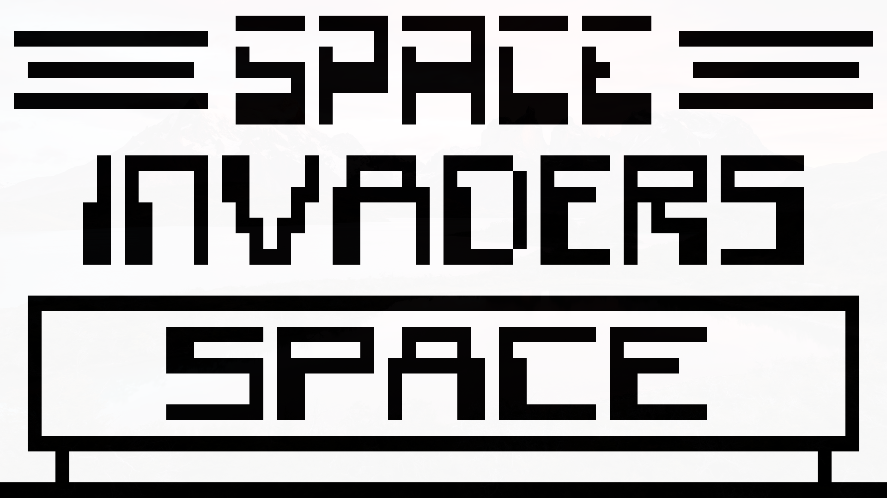

# C++ CHIP-8 Emulator

[CHIP-8](https://en.wikipedia.org/wiki/CHIP-8) emulator written in C++17

* SDL2
* Sound
* Fully tested
* Conan for dependency management
* clang-format

## Space Invaders



## Pong


# Test ROM

Taken from: https://github.com/corax89/chip8-test-rom

# Build

```sh
mkdir build
cmake -Bbuild .
cmake --build build
```

# Run a ROM / Play a game

```sh
./build/chip8 <path-to-rom>
```

# Running the Tests
```sh
ctest --test-dir build
```
